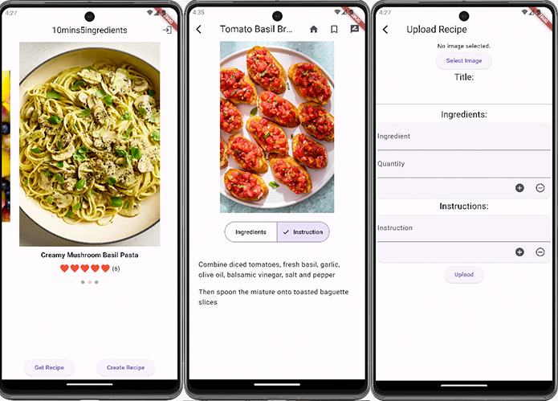
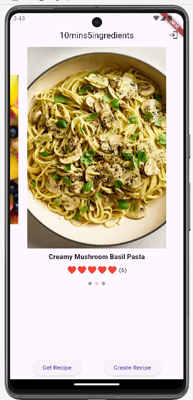
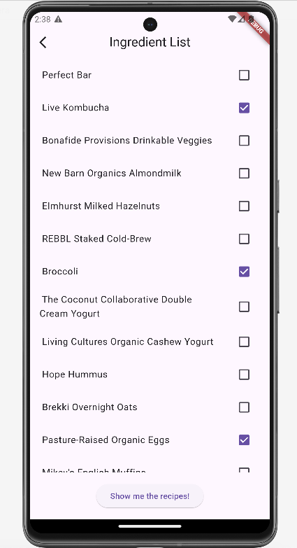
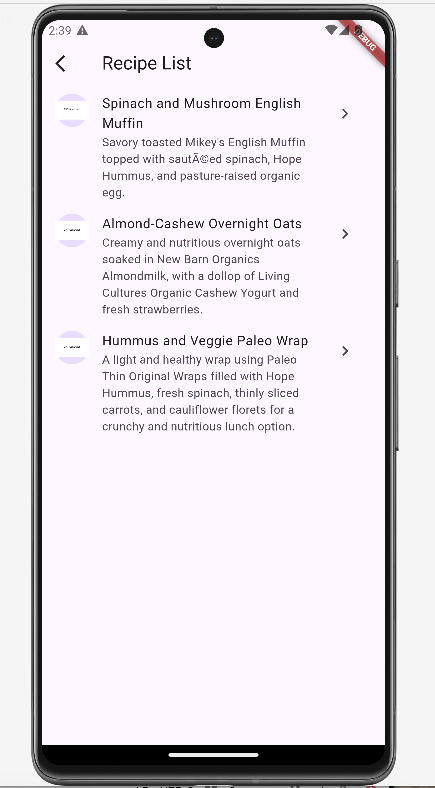
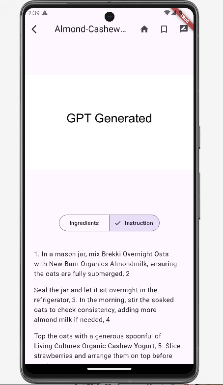
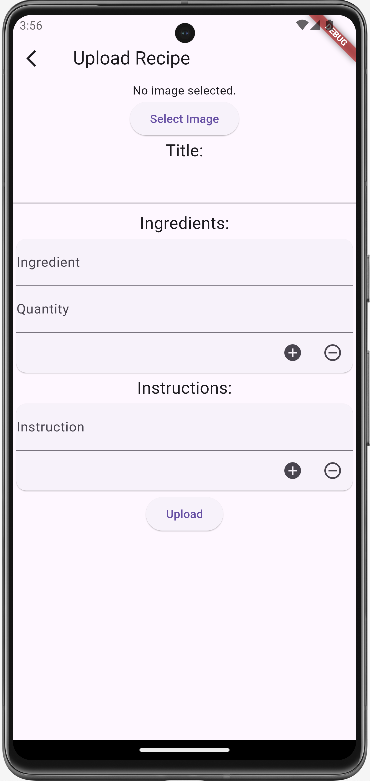

# Ten mins Five ingredients



Ten mins Five ingredients provides users with ultra-fast recipes that can be prepared in approximately ten minutes, utilizing a maximum of five ingredients.

## How it Works

This application offers users quick and easy recipes that can be prepared in just about ten minutes, using a maximum of five ingredients. Users can either upload their own recipes or make use of the fridge image detection feature to get three suitable recipes based on the ingredients they have.
The application is developed using Flutter and makes use of the OpenAI API, as well as Firebase Authentication and Realtime Database.

## Screenshots

<div style="display: flex; justify-content: center;">
    
        <p style="font-style: italic;">The welcome page - You can either log in or use register mode</p>
</div>
<div style="display: flex; justify-content: center;">
     
    <p style="font-style: italic;">Our system will detect ingredients in the image. The user can select up to 5 ingredients at a time.</p>
</div>
<div style="display: flex; justify-content: center;">
    
    <p style="font-style: italic;">The system will return three different recipes for the user.</p>
</div>
<div style="display: flex; justify-content: center;">
    
    <p style="font-style: italic;">Users can click the list and review the recipe details.</p>
</div>
<div style="display: flex; justify-content: center;">
    
    <p style="font-style: italic;">User can also upload their recipe.</p>
</div>

## Getting Started

To run Ten mins Five ingredients locally on your machine, follow these steps:

1. Clone this repository.
2. Navigate to the project directory.
3. Create a .env file in the root of the project with the example content:
 ```sh
    OPENAI_API_KEY= PUT YOUR KEY HERE
```
4.Currently, the Database is connected to our own Firebase database; if you'd like to use your Database, remember to replace the `firebase_options.dart` file and update the path.

## License

Ten mins Five ingredients is released under the [MIT License](/path/to/license).
